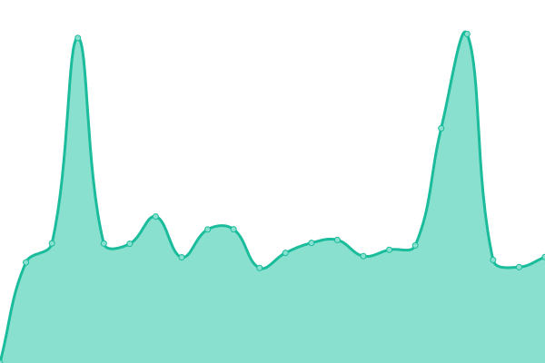
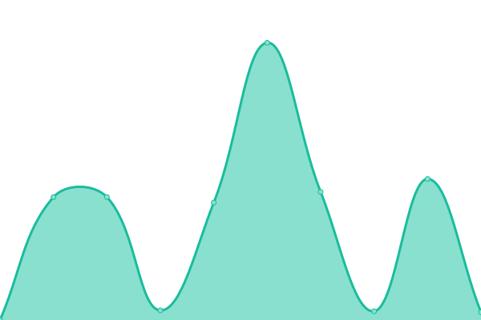

# [📈 Live Status](https://upptime.kedi.dev): <!--live status--> **🟧 Partial outage**

This repository contains the open-source uptime monitor and status page for [Ananth](https://upptime.kedi.dev), powered by [Upptime](https://github.com/upptime/upptime).

With [Upptime](https://upptime.js.org), you can get your own unlimited and free uptime monitor and status page, powered entirely by a GitHub repository. We use [Issues](https://github.com/ananthb/upptime/issues) as incident reports, [Actions](https://github.com/ananthb/upptime/actions) as uptime monitors, and [Pages](https://upptime.kedi.dev) for the status page.

<!--start: status pages-->
<!-- This summary is generated by Upptime (https://github.com/upptime/upptime) -->
<!-- Do not edit this manually, your changes will be overwritten -->
<!-- prettier-ignore -->
| URL | Status | History | Response Time | Uptime |
| --- | ------ | ------- | ------------- | ------ |
|  [Mon](https://mon.tail42937.ts.net) | 🟥 Down | [mon.yml](https://github.com/ananthb/upptime/commits/HEAD/history/mon.yml) | 

 1670ms
     
 | 

<a href="https://upptime.kedi.dev/history/mon">99.75%</a>
    

|  [/dev/human blog](https://devhuman.net) | 🟩 Up | [dev-human-blog.yml](https://github.com/ananthb/upptime/commits/HEAD/history/dev-human-blog.yml) | 

 279ms
     
 | 

<a href="https://upptime.kedi.dev/history/dev-human-blog">100.00%</a>
    

|  [Futura Physio](https://futuraphysio.com) | 🟩 Up | [futura-physio.yml](https://github.com/ananthb/upptime/commits/HEAD/history/futura-physio.yml) | 

 861ms
     
 | 

<a href="https://upptime.kedi.dev/history/futura-physio">99.82%</a>
    

|  [Lila Arts Centre](https://lilaartscentre.com) | 🟩 Up | [lila-arts-centre.yml](https://github.com/ananthb/upptime/commits/HEAD/history/lila-arts-centre.yml) | 

 243ms
     
 | 

<a href="https://upptime.kedi.dev/history/lila-arts-centre">100.00%</a>
    

|  [Shakthi Palace](https://shakthipalace.com) | 🟩 Up | [shakthi-palace.yml](https://github.com/ananthb/upptime/commits/HEAD/history/shakthi-palace.yml) | 

 269ms
     
 | 

<a href="https://upptime.kedi.dev/history/shakthi-palace">100.00%</a>
    

|  [Dr. Vibhu](https://drvibhu.com) | 🟩 Up | [dr-vibhu.yml](https://github.com/ananthb/upptime/commits/HEAD/history/dr-vibhu.yml) | 

 1186ms
     
 | 

<a href="https://upptime.kedi.dev/history/dr-vibhu">100.00%</a>
    

|  [Bhaskar's Blog](https://bhaskararaman.com) | 🟩 Up | [bhaskar-s-blog.yml](https://github.com/ananthb/upptime/commits/HEAD/history/bhaskar-s-blog.yml) | 

 296ms
     
 | 

<a href="https://upptime.kedi.dev/history/bhaskar-s-blog">100.00%</a>
    

<!--end: status pages-->

[**Visit our status website →**](https://upptime.kedi.dev)

## 📄 License

- Powered by: [Upptime](https://github.com/upptime/upptime)
- Code: [MIT](./LICENSE) © [Anand Chowdhary](https://anandchowdhary.com), supported by [Pabio](https://pabio.com)
- Data in the `./history` directory: [Open Database License](https://opendatacommons.org/licenses/odbl/1-0/)
